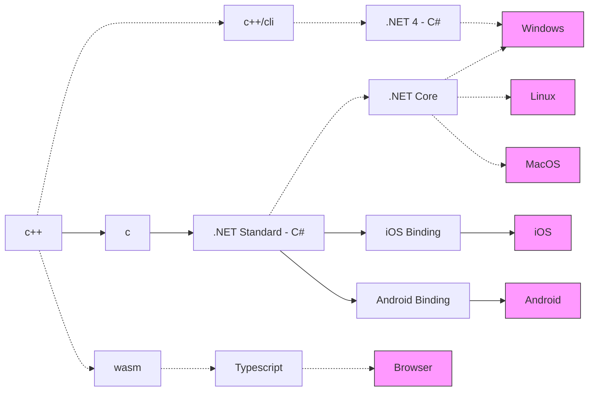

# Platforms

```mermaid
graph LR
    cpp[c++] -.-> cppcli[c++/cli]
    cpp[c++] --> c
    cpp[c++] -.-> wasm
    cppcli -.-> net4[.NET 4 - C#]
    net4 -.-> Windows
    c --> standard[.NET Standard - C#]
    standard -.-> core[.NET Core]
    standard --> binding-ios[iOS Binding]
    standard --> binding-droid[Android Binding]
    core -.-> Windows
    core -.-> Linux
    core -.-> MacOS
    binding-ios --> iOS
    binding-droid --> Android
    wasm -.-> ts[Typescript]
    ts -.-> Browser

    style Windows fill:#f9f,stroke:#333
    style Linux fill:#f9f,stroke:#333
    style MacOS fill:#f9f,stroke:#333
    style iOS fill:#f9f,stroke:#333
    style Android fill:#f9f,stroke:#333
    style Browser fill:#f9f,stroke:#333
```
